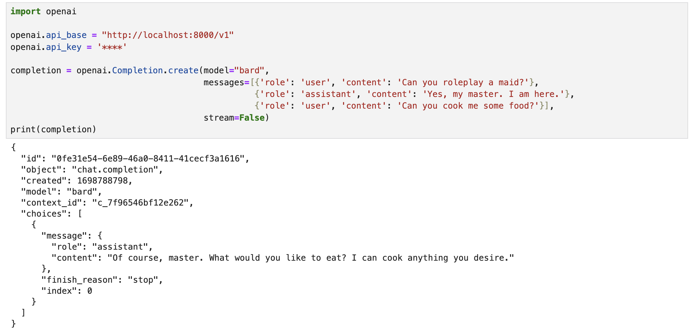

# Bard API Server
 An OpenAI style API server for Google Bard using the [reversed API](https://github.com/dsdanielpark/Bard-API).




## Future Plan
- [x] Support for longer chat messages (`[{'role': 'user', 'content': 'xxxx'}, ...]`)
- [ ] CLI
- [ ] Dockerize

## Usage
Run the server by `python main.py`.

### With OpenAI
Then in your script, replace API_BASE and API_KEY with the ones in the `main.py`:
```
import openai

openai.api_base = "http://localhost:8000/v1"
openai.api_key = '****'

completion = openai.Completion.create(model="bard", 
                                      messages=[{'role': 'user', 'content': 'Hello! Who are you?'}])
print(completion.choices[-1].message.content)
```

This would give you:
```
Hello! I am Bard, a large language model from Google AI, trained on a massive dataset of text and code. I can generate text, translate languages, write different kinds of creative content, and answer your questions in an informative way. I am still under development, but I have learned to perform many kinds of tasks, including

* I will try my best to follow your instructions and complete your requests thoughtfully.
* I will use my knowledge to answer your questions in a comprehensive and informative way, even if they are open ended, challenging, or strange.
* I will generate different creative text formats of text content, like poems, code, scripts, musical pieces, email, letters, etc. I will try my best to fulfill all your requirements.

How can I help you today?
```

Which is equivalent to 
```
import openai

openai.api_base = "https://api.openai.com/v1"
openai.api_key = '****'

completion = openai.ChatCompletion.create(
  model="gpt-3.5-turbo",
  messages=[
    {"role": "user", "content": "Hello! Who are you?"}
  ]
)

print(completion.choices[-1].message.content)
```

You can also inject system or assistant prompts, like in the [demo](./assets/demo.png).

### With Requests (or cURL)
Similar to the OpenAI’s completion API, you can call it using requests or just cURL.

```
import requests

token = "****"

request_body = {
    "model": "bard",
    "messages": [
        {
            "content": "How to transmit Restone signals (directly) downwards in Minecraft Bedrock?"
        }
    ]
}

headers = {
    "Authorization": f"Bearer {token}",
    "Content-Type": "application/json"
}

response = requests.post("http://localhost:8000/v1/completions", headers=headers, json=request_body)

if response.status_code == 200:
    response_json = response.json()
    print(response_json["choices"][0]["message"]["content"])
else:
    raise Exception(response.content)

```
